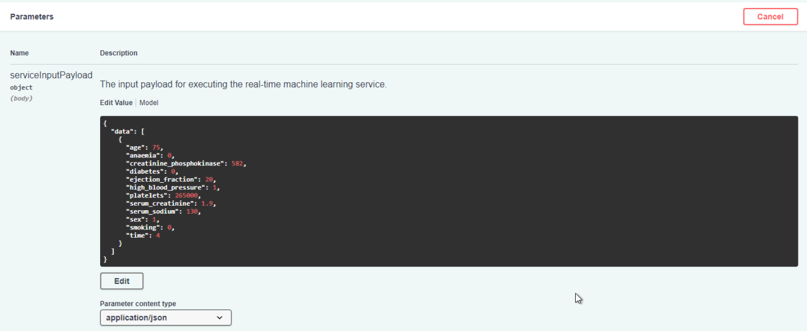

# Heart Failure Prediction using Microsoft Azure

## Project Overview

Cardiovascular diseases (CVDs) are the number 1 cause of death globally, taking an estimated 17.9 million lives each year, which accounts for 31% of all deaths worlwide.
Heart failure is a common event caused by CVDs. People with cardiovascular disease or who are at high cardiovascular risk need early detection and management wherein a machine learning model can be of great help. This project involves training Machine Learning Model to predict mortality by Heart Failure using Microsoft Azure and deployment of the model as a web service. We also figure the main factors that cause mortality.

## Project Architecture

*Figure 1 : The following diagram shows the overall architecture and workflow of the project.*


## Project Details
* [Project Set Up and Installation](#project-set-up-and-installation)
* [Dataset](#dataset)
  * [Overview](#overview)
  * [Exploratory Data Analysis](#exploratory-data-analysis)
  * [Task](#task)
  * [Access](#access)
* [Automated ML](#automated-ml)
  * [Results](#results)
* [Hyperparameter Tuning](#hyperparameter-tuning)
  * [Results](#results)
* [Model Deployment](#model-deployment)
* [Screen Recording](#screen-recording)
* [Standout Suggestions](standout-suggestions)
* [Improvements and Future Work](#improvements-and-future-work)
* [References](#references)

## Project Set Up and Installation

Firstly, we need an Azure subscription to access the Azure workspace. For this project, the Azure subscription provided by Udacity was used.

### Create a Workspace

The workspace is the top-level resource that provodes a centralized place to work with all the artifacts we create when we use Azure Machine Learning. The workspace keeps a history of all training runs, including logs, metrics, output, and a snapshot of our scripts. 

The workspace can be created with the help of [Create and manage Azure Machine Learning workspaces](https://docs.microsoft.com/en-us/azure/machine-learning/how-to-manage-workspace?tabs=python) document.

### Set up Compute Instance

A compute instance is a managed cloud-based workstation which is used as a fully configured and managed development environment. 

A compute instance with name `notebook139012` and virtual machine size of `STANDARD_DS3_V2` was created.

*Figure 2 : The screenshot below shows the registered compute instances.*


### Set up Compute Cluster

Compute cluster is a managed-compute infrastructure that allows us to easily create a single or multi-node compute. Compute clusters scales up automatically when a job is submitted and can run jobs securely in a virtual network environment.

A compute cluster `new-compute` with virtual machine size of `STANDARD_D2_V2` and `max_nodes = 4` was created.

### Set up Docker

Docker is an open platform for developing, shipping, and running applications. Here Docker is used for running Swagger on localhost.

The docker can set up using [Get Docker](https://docs.docker.com/get-docker/).

## Dataset

A dataset external to the Azure ML ecosystem and supported by the Azure ML's `automl` API was used.

### Overview

The dataset used in this project is [Heart Failure Prediction](https://www.kaggle.com/andrewmvd/heart-failure-clinical-data) dataset from [Kaggle](https://www.kaggle.com/). It consists of 299 rows and 13 columns

### Exploratory Data Analysis

The preliminary exploratory data analysis on the dataset is shown in [Exploratory Data Analysis.ipynb](Exploratory%20Data%20Analysis.ipynb)

### Task

Heart failure is a common event caused by cardiovascular diseases which is the number 1 cause of death globally. People with cardiovascular disease or who are at high cardiovascular risk need early detection and management wherein a machine learning model can be of great help. 

The total features of the dataset are :

  * `age` - Age
  * `anaemia` - Decrease of red blood cells or hemoglobin (boolean)
  * `creatinine_phosphokinase` - Level of the CPK enzyme in the blood (mcg/L)
  * `diabetes` - If the patient has diabetes (boolean)
  * `ejection_fraction` - Percentage of blood leaving the heart at each contraction (percentage)
  * `high_blood_pressure` - If the patient has hypertension (boolean)
  * `platelets` - Platelets in the blood (kiloplatelets/mL)
  * `serum_creatinine` - Level of serum creatinine in the blood (mg/dL)
  * `serum_sodium` - Level of serum sodium in the blood (mEq/L)
  * `sex` - Woman or man (binary)
  * `smoking` - If the patient smokes or not (boolean)
  * `time` - Follow-up period (days)  
  * `DEATH_EVENT` - If the patient deceased during the follow-up period (boolean)

Out of the 13 features mentioned above, the first 12 features are used for training the model and the last feature `DEATH_EVENT` is the target column. The task is to classify `DEATH_EVENT` to `0` or `1` i.e to predict the mortality by heart failure.

### Access

The dataset is first downloaded from the Kaggle as a [csv file](heart_failure_clinical_records_dataset.csv). 
It is then uploaded from the local files and registered to the Azure Workspace as a Tabular dataset format. 

*Figure 3 : The registered datasets are shown below.*


This dataset can then be accessed in our jupyter notebook by

``` ds = Dataset.get_by_name(ws, 'heart-failure-dataset') ```

## Automated ML
*TODO*: Give an overview of the `automl` settings and configuration you used for this experiment
### Automated Machine Learning (AutoML)

* Automated machine learning is the process of automating the time consuming, iterative tasks of machine learning model development. 
* It allows us to build ML models with high scale, efficiency, and productivity all while sustaining model quality.

### 

### Results
*TODO*: What are the results you got with your automated ML model? What were the parameters of the model? How could you have improved it?

*TODO* Remeber to provide screenshots of the `RunDetails` widget as well as a screenshot of the best model trained with it's parameters.

## Hyperparameter Tuning
*TODO*: What kind of model did you choose for this experiment and why? Give an overview of the types of parameters and their ranges used for the hyperparameter search


### Results
*TODO*: What are the results you got with your model? What were the parameters of the model? How could you have improved it?

*TODO* Remeber to provide screenshots of the `RunDetails` widget as well as a screenshot of the best model trained with it's parameters.

## Model Deployment
*TODO*: Give an overview of the deployed model and instructions on how to query the endpoint with a sample input.

## Screen Recording

Screen Recording of the project can be viwed using this [YouTube](https://www.youtube.com/watch?v=ihynrOmvCiU&t=43s) link.

This shows demo of:
- Working model
- Deployed  model
- Sample request sent to the endpoint and its response

## Standout Suggestions

**1. Converting the Model into ONNX Format:**

 Open Neural Network Exchange (ONNX) is an open standard format for representing machine learning models. 
 ONNX helps in enabling interoperability between different frameworks and streamlining the path from research to production.
 
 Our best model i.e the AutoML model is converted to ONNX format which will allow us to interchange models between various ML frameworks and tools.
 
 For this we set the parameter `return_onnx_model = True` to retrieve the best ONNX model, instead of the Python model.

``` 
from azureml.automl.runtime.onnx_convert import OnnxConverter
best_run, onnx_mdl = remote_run.get_output(return_onnx_model=True) 
```
This model is then saved and the results are predicted.

```
onnxrt_helper = OnnxInferenceHelper(mdl_bytes, onnx_res)
pred_onnx, pred_prob_onnx = onnxrt_helper.predict(test_df)
print(pred_onnx)
```
More details about the ONNX model generated can viewed in [this notebook](automl-onnx.ipynb).

**2. Enabling Application Insights:**

Application Insights, a feature of Azure Monitor, is an extensible Application Performance Management (APM) service. It is used to monitor our live applications. It will automatically detect performance anomalies, and includes powerful analytics tools to help us diagnose issues and to understand what users actually do with our application.

The application insights for displaying logs can be enabled for the deployed model endpoint by:

```
service.update(enable_app_insights = True)
```

*Figure x : The screenshot below shows the Application Insight Enabled for the deployed model.*


*Figure y : We can access the logs through the Application Insights URL*


**3. Consuming Model Endpoint:**
 
In this step, we will consume the deployed model using Swagger to interact with the HTTP REST API endpoint documentation. For this we will first downlad the [swagger.json](swagger/swagger.json) file that Azure provides for deployed models. Next we will run the [swagger.sh](swagger/swagger.sh) file to pull the latest swagger-ui docker image and run it on port 9000. Finally we run [serve.py](swagger/serve.py) script to serve the swagger.json for our model on an HTTP server.

To interact with deployed web service's API resources, we go to localhost:9000 and change URL on Swagger UI to http://localhost:8000/swagger.json.  

*Figure e : This is shown in the figure below*


*Figure x : The screenshot below shows the HTTP API POST operation with the parameters being passed.*



*Figure y : The reponse received by the POST Operation*


## Improvements and Future Work


## References


